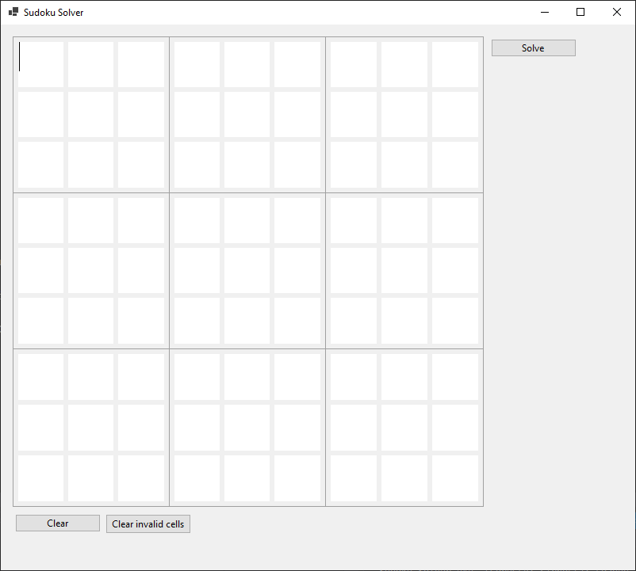
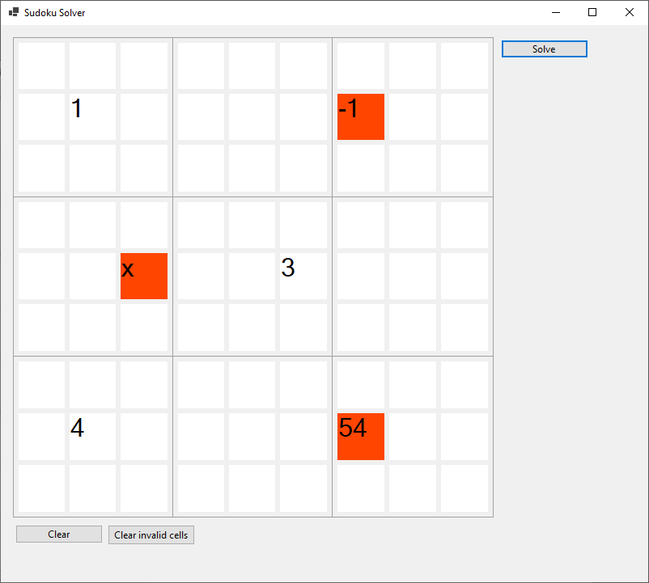
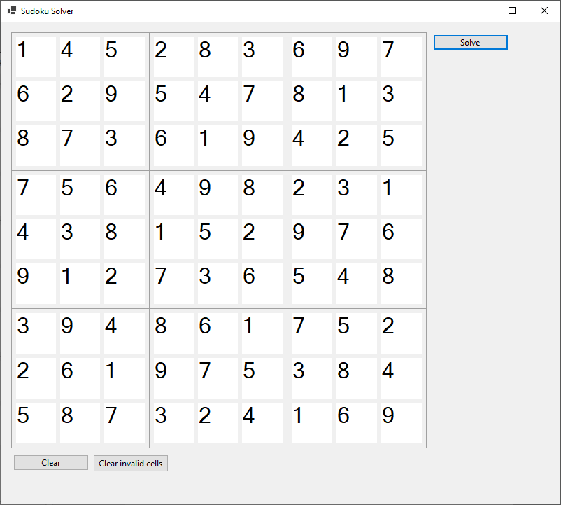

# Sudoku_Solver_WinForms

written in C#, using Windows Forms for the user interface

## graphical user interface

## sudoku solving algorithm

- values for empty cells are found by eliminating possible values,
- checking for missing values in rows, columns and blocks,
- using backtracking when empty cells remain
